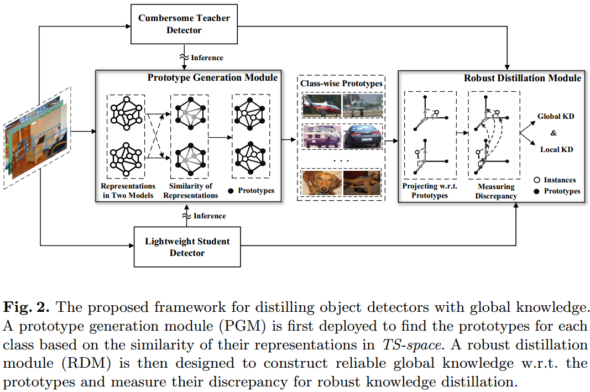

# Implementation of [**Distilling Object Detectors With Global Knowledge**]

## 1 Abstract
    
Existing methods regard the knowledge as the feature of each instance or their relations, which is the instance-level knowledge only from the teacher model, i.e., the *local knowledge*. However, the empirical studies show that the local knowledge is much noisy in object detection tasks, especially on the blurred, occluded, or small instances. Thus, a more intrinsic approach is to measure the representations of instances w.r.t. a group of common basis vectors in the two feature spaces of the teacher and the student detectors, i.e., the *global knowledge*. Then, the distilling algorithm can be applied as space alignment. To this end, a novel *prototype generation module* (PGM) is proposed to fnd the common basis vectors, dubbed prototypes, in the two feature spaces. Then, a *robust distilling module* (RDM) is applied to construct the global knowledge based on the prototypes and fltrate noisy local knowledge by measuring the discrepancy of the representations in two feature spaces. 



## 2 Dependencies

- Python==3.6.5
- PyTorch==1.3.0
- opencv==4.1.2
- numpy==1.19.5
- kornia==0.1.4
- mmcv==1.3.4
- mmdet==2.11
- cuda==10.0
- cudnn==7.6

Other versions of above dependencies might also work without fully test.


## 3 Pre-trained Models

The bare student and teacher detectors trained on COCO datasets can be downloaded from the Model Zoo of the [MMDetection](https://github.com/open-mmlab/mmdetection).

*Notice*: the pretrained models in newest version of MMDetection might be **imcompatible** with this repo, please use the links listed bellow.

### 3.1 Pretrained Faster R-CNN (COCO)

| Backbone       | Style   | Lr Schedule | mAP  | model download                                               |
| -------------- | ------- | ----------- | ---- | ------------------------------------------------------------ |
| Resnet-50-FPN  | pytorch | 2x          | 38.4 | [model](http://download.openmmlab.com/mmdetection/v2.0/faster_rcnn/faster_rcnn_r50_fpn_2x_coco/faster_rcnn_r50_fpn_2x_coco_bbox_mAP-0.384_20200504_210434-a5d8aa15.pth) |
| Resnet-101-FPN | pytorch | 2x          | 39.8 | [model](http://download.openmmlab.com/mmdetection/v2.0/faster_rcnn/faster_rcnn_r101_fpn_2x_coco/faster_rcnn_r101_fpn_2x_coco_bbox_mAP-0.398_20200504_210455-1d2dac9c.pth) |

### 3.2 Pretrained RetinaNet (COCO)

| Backbone       | Style   | Lr Schedule | mAP  | model download                                               |
| -------------- | ------- | ----------- | ---- | ------------------------------------------------------------ |
| Resnet-50-FPN  | pytorch | 2x          | 37.4 | [model](http://download.openmmlab.com/mmdetection/v2.0/retinanet/retinanet_r50_fpn_2x_coco/retinanet_r50_fpn_2x_coco_20200131-fdb43119.pth) |
| Resnet-101-FPN | pytorch | 2x          | 38.9 | [model](http://download.openmmlab.com/mmdetection/v2.0/retinanet/retinanet_r101_fpn_2x_coco/retinanet_r101_fpn_2x_coco_20200131-5560aee8.pth) |


## 4 Training

- Download the pre-trained models [see section 3] and put them in ```checkpoints/```.

- Run:

  ```bash
  cd /your/project/path
  bash tools/train.sh
  ```

**Notes:**

- Hyper-parameters that used for experiments in the paper are specified at scripts in `configs/faster_rcnn_coco_kd_config.py`.
- Requires more than 20GB of GPU memory if batch size of 16 (8 GPU with 2 samplers per GPU on Tesla_V100-SXM2-32GB with 32GB of gpu memory).


## 5 Evaluation

- Run:

  ```bash
  cd /your/project/path
  bash tools/test.sh
  ```

- The performance comparison by using **Faster RCNN** in COCO dataset is as follows:

  | Method                                                       | mAP（%）     | AP50（%） | AP75（%） | model download                                               |
  | ------------------------------------------------------------ | ------------ | --------- | --------- | ------------------------------------------------------------ |
  | tracher (res101)                                             | 39.8         | 60.1      | 43.3      | [model](http://download.openmmlab.com/mmdetection/v2.0/faster_rcnn/faster_rcnn_r101_fpn_2x_coco/faster_rcnn_r101_fpn_2x_coco_bbox_mAP-0.398_20200504_210455-1d2dac9c.pth) |
  | student (res50)                                              | 38.4         | 59.0      | 42.0      | [model](http://download.openmmlab.com/mmdetection/v2.0/faster_rcnn/faster_rcnn_r50_fpn_2x_coco/faster_rcnn_r50_fpn_2x_coco_bbox_mAP-0.384_20200504_210434-a5d8aa15.pth) |
  | [FGFI](Tao Wang, Li Yuan, Xiaopeng Zhang and Jiashi Feng. Distilling object detectors with finegrained feature imitation. In CVPR, 2019.) | 39.3（+0.9） | 59.8      | 42.9      | -                                                            |
  | [DeFeat](Jianyuan Guo, Kai Han, Yunhe Wang, Han Wu, Xinghao Chen, Chunjing Xu, and Chang Xu. Distilling object detectors via decoupled features. In CVPR, 2021.) | 40.3（+1.9） | 60.9      | 44.0      | -                                                            |
  | [FBKD](Linfeng Zhang and Kaisheng Ma. Improve object detection with feature-based knowledge distillation: Towards accurate and efficient detectors. In ICLR, 2021.) | 40.2（+1.8） | 60.4      | 43.6      | -                                                            |
  | [GID](Xing Dai, Zeren Jiang, Zhao Wu, Yiping Bao, Zhicheng Wang, Si Liu, and Erjin Zhou. General instance distillation for object detection. In CVPR, 2021.) | 40.2（+1.8） | 60.8      | 43.6      | -                                                            |
  | ours                                                         | 40.6（+2.2） | 61.0      | 44.0      | to be released soon                                          |

- The performance comparison by using **RetinaNet** in COCO dataset is as follows:

  | Method                                                       | mAP（%）     | AP50（%） | AP75（%） | model download                                               |
  | ------------------------------------------------------------ | ------------ | --------- | --------- | ------------------------------------------------------------ |
  | tracher (res101)                                             | 38.9         | 58.0      | 41.5      | [model](http://download.openmmlab.com/mmdetection/v2.0/retinanet/retinanet_r101_fpn_2x_coco/retinanet_r101_fpn_2x_coco_20200131-5560aee8.pth) |
  | student (res50)                                              | 37.4         | 56.7      | 39.6      | [model](http://download.openmmlab.com/mmdetection/v2.0/retinanet/retinanet_r50_fpn_2x_coco/retinanet_r50_fpn_2x_coco_20200131-fdb43119.pth) |
  | [FGFI](Tao Wang, Li Yuan, Xiaopeng Zhang, and Jiashi Feng. Distilling object detectors with finegrained feature imitation. In CVPR, 2019.) | 38.6（+1.2） | 58.7      | 41.3      | -                                                            |
  | [DeFeat](Jianyuan Guo, Kai Han, Yunhe Wang, Han Wu, Xinghao Chen, Chunjing Xu, and Chang Xu. Distilling object detectors via decoupled features. In CVPR, 2021.) | 39.3（+1.9） | 58.2      | 42.1      | -                                                            |
  | [FBKD](Linfeng Zhang and Kaisheng Ma. Improve object detection with feature-based knowledge distillation: Towards accurate and efficient detectors. In ICLR, 2021.) | 39.3（+1.9） | 58.3      | 42.3      | -                                                            |
  | [GID](Xing Dai, Zeren Jiang, Zhao Wu, Yiping Bao, Zhicheng Wang, Si Liu, and Erjin Zhou. General instance distillation for object detection. In CVPR, 2021.) | 39.1（+1.7） | 59.0      | 42.3      | -                                                            |
  | [PFI](Gang Li, Xiang Li, Yujie Wang, et al. Knowledge Distillation for Object Detection via Rank Mimicking and Prediction-guided Feature Imitation. In AAAI, 2022.) | 39.6（+2.2） | -         | -         | -                                                            |
  | ours                                                         | 39.8（+2.4） | 58.6      | 42.6      | to be released soon                                          |
  

Please see the paper for more evaluation results and analysis.

## 6 Citation

If you use this repo in your research, please cite:

```
@inproceedings{globalknowledge,
  title = {Distilling Object Detectors with Global Knowledge},
  author = {Sanli Tang, Zhongyu Zhang, Zhanzhan Cheng, Jing Lu, Yunlu Xu, Yi Niu, Fan He},
  booktitle = {ECCV},
  year = {2022}
}
```

## 7 License & Copyright

This repo is released under the Apache 2.0 license, as found in the LICENSE file.

This repo follows the open source project [MMDetection](https://github.com/open-mmlab/mmdetection), where the codes follow the original distributive licenses

## 8 Acknowledgement

Our codes are based on the open source project [MMDetection](https://github.com/open-mmlab/mmdetection).


## 9 Filelist

The file list is as follows:

├── checkpoints                                                            # directory of the pre-trained models
├── configs                                                                     # config files of the bare teacher/student detectors and KD
│   ├── faster_rcnn_coco_101.py                                 # config file of teacher baseline
│   ├── faster_rcnn_coco_50.py                                   # config file of student baseline
│   └── faster_rcnn_coco_kd_config.py                      # config file of KD
├── datalists                                                                   # annotation files of the datasets
│   ├── classes_config.json                                           # json file of classes' name
│   ├── instances_train2017.json                                # json file of trainning infos
│   └── instances_val2017.json                                   # json file of testing infos
├── ObjectPerceptron                                                  # toolbox and benchmark library
│   ├── mmcv                                                                 # public mmcv toolbox
│   ├── mmdetection
│   │   ├── mmdet                                                           # public mmdetection toolbox
│   │   └── third_party
│   │   │  └── **kd**                                                             # **the main source code of our method**
├── ReadMe.md
├── tools                                                                          # tools used in KD
│   ├── test.sh                                                                 # entrance to evaluation
│   ├── test.py                                                                 # scripts for evaluation
│   ├── train.py                                                                # main function to train
│   └── train.sh                                                                # entrance to train
└── work_dir                                                                   # directory to save anything during training

